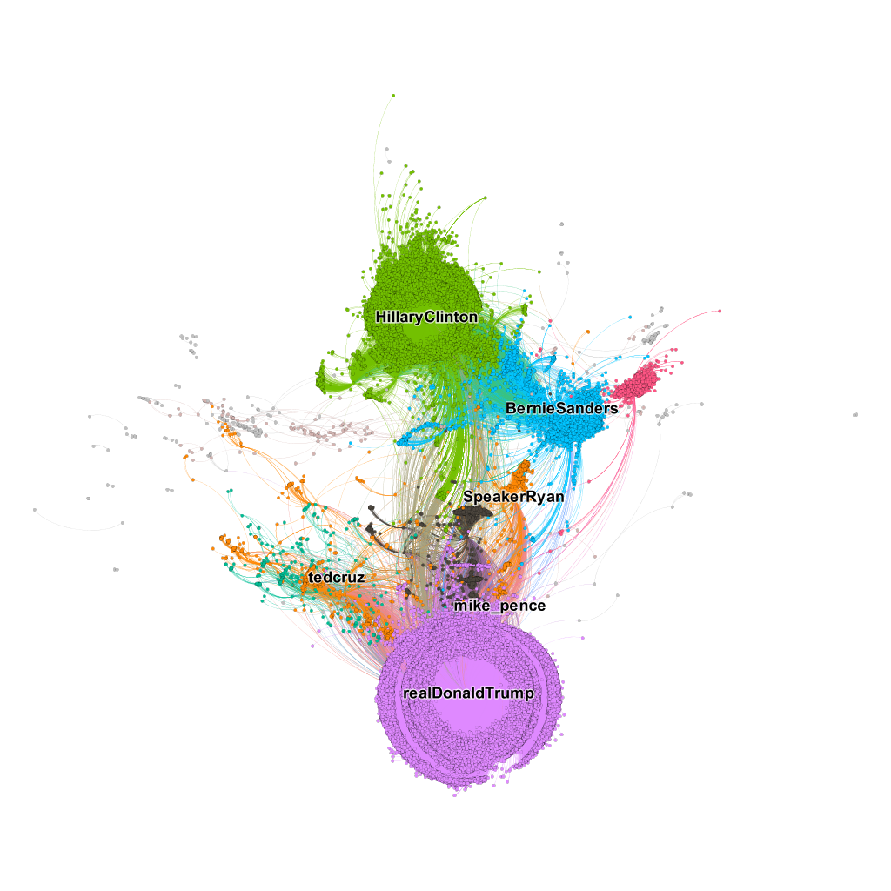
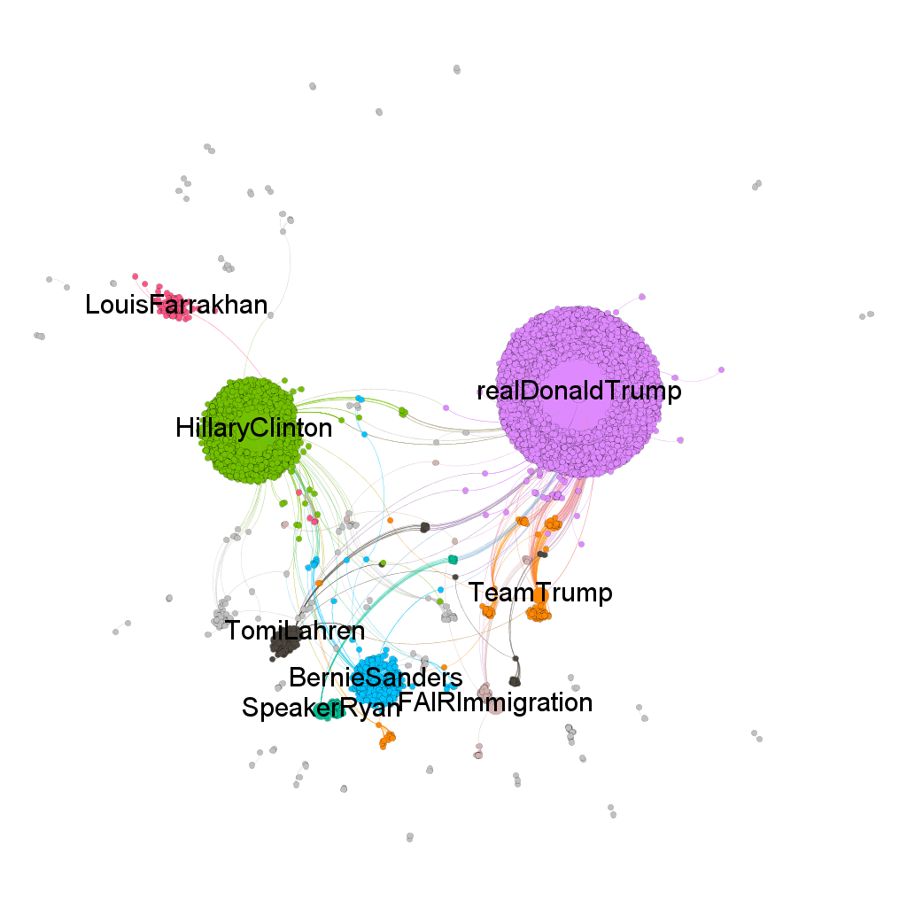
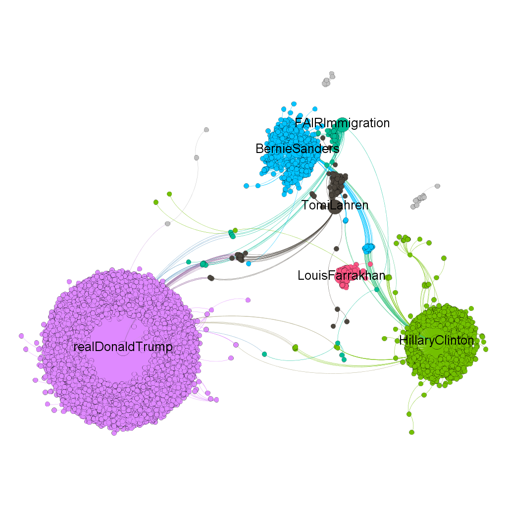
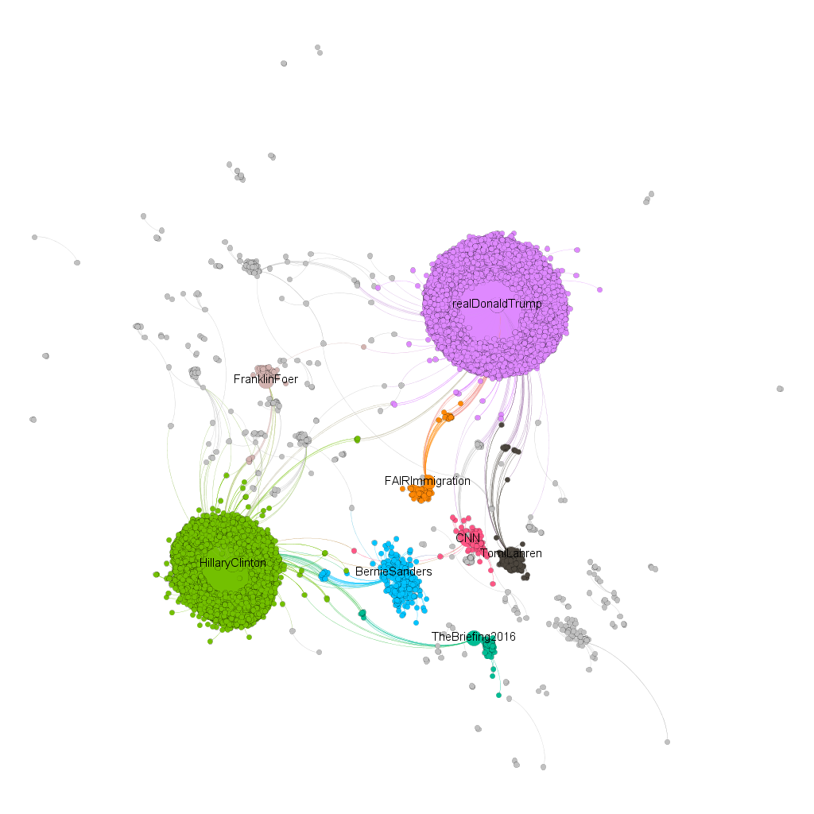
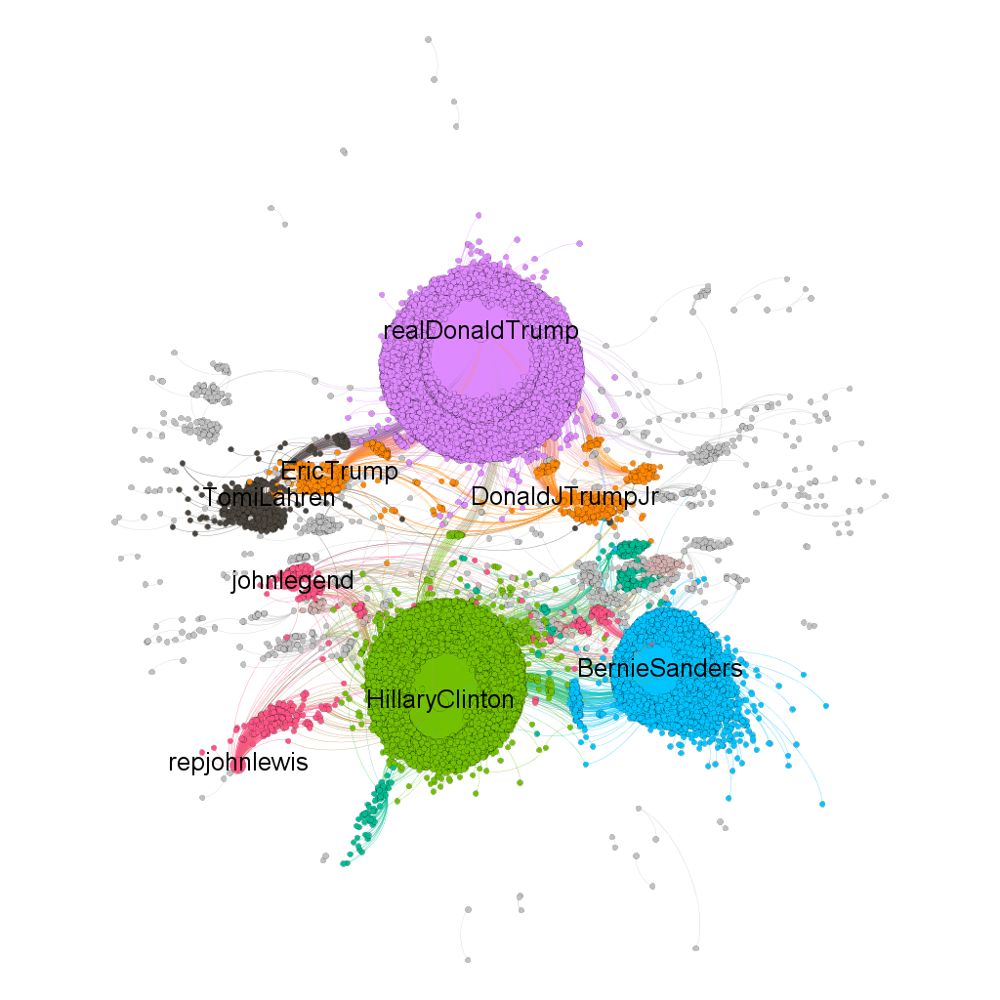
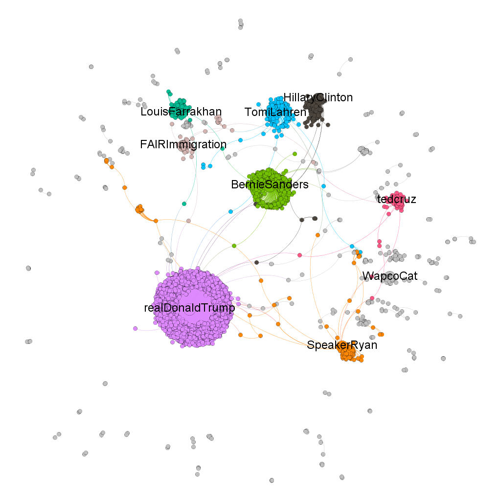

## Distributed Community Detection Via Louvain Modularity

* https://github.com/Sotera/spark-distributed-louvain-modularity

* https://github.com/athinggoingon/louvain-modularity

They are supposed to be distributed versions of the paper:

* Blondel, V. D., Guillaume, J., Lambiotte, R., and Lefebvre, E. Fast unfolding of communities in large networks, 2008. 
* See:
  * [https://arxiv.org/pdf/0803.0476.pdf](https://arxiv.org/pdf/0803.0476.pdf)
  * or local copy at: scalable-data-science/meme-evolution/whitePapers/fastUnfoldingofCommunitiesInLargeNetworks2008.pdf

* Idea in a hurry: *Modularity algorithm implemented in Gephi for community detection looks for the nodes that are more densely connected together than to the rest of the network. It is based ona  aprtition of the network.*
  * See: http://stackoverflow.com/questions/21814235/how-can-modularity-help-in-network-analysis

## Gephi outputs from community detection

### 3rd US Presidential Debate Retweet Netowrk's Community Structure

* The network showing the community structure and interaction between the Republican and Democratic candidates during the 3rd US presidential debate of 2016. 
* Most members were not active during the debate and their tweets are missing in the streamed data set. 
* Note: 100% of the retweet data were used for the visualization.
* Output of 'figures/US3rdPersidentialDebate22KRetweetNetwork.png'
* 

### Community structure from retweets by event date. 

* The attached png images in ./figures/ folder include the first output for Oct 19 2016 where 50 communities were identified. The top 8 communities are labelled.
  * Output of `figures/October_19_2016.png`
    * 
  * Output of `figures/Top10_October_19_2016.png`
    * 

* All the data are 5% sample of the 24hours streamed tweets for each of the selected presidential election event. The title format for the dataset is "event-DAY-MONTH-YEAR".

  * Output of `figures/October_24_2016.png`
    * 

  * Output of `figures/Top6_October_24_2016.png`
    * 

  * Output of `figures/Nov_1_2016.png`
    * 
  * Output of `figures/Top_Nov_1_2016.png`
    * 

  * Output of `figures/Nov_08_2016.png`
    * 

  * Output of `figures/Nov_15_2016.png`
    * 

